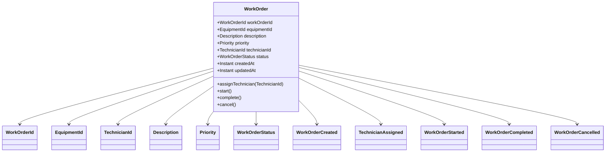
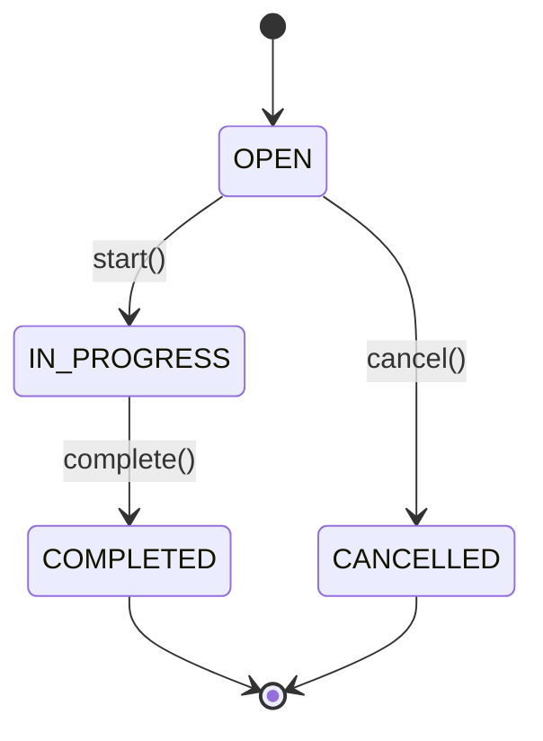

# Mô hình miền (Domain Model) cho tính năng Quản lý Phiếu công việc (Work Order)

> Tài liệu này là bản đề xuất thiết kế miền theo hướng Domain-Driven Design (DDD) cho tính năng Work Order trong dự án `core`. Nó không mô tả code hiện có, vì repo hiện đang là scaffold/demo và tính năng Work Order chưa được triển khai.

## 1. Bối cảnh miền và Bounded Context Overview

### 1.1 Bối cảnh miền
Trong miền vận hành bảo trì/thiết bị, Work Order đại diện cho một phiếu công việc cần xử lý cho một thiết bị trong công trường. Phiếu này gắn với một thiết bị cụ thể, có mức độ ưu tiên, mô tả công việc, và có thể được phân công cho một thợ kỹ thuật thực hiện.

Domain chính được xem là:
- Work Order Management
- Field Maintenance Operations

### 1.2 Bounded Context
Bounded Context đề xuất cho tính năng này là:
- `Work Order Management`: quản lý vòng đời phiếu công việc từ tạo, phân công, bắt đầu, hoàn thành, đến hủy.
- `Equipment Reference`: thông tin liên quan đến thiết bị, như mã và trạng thái thiết bị nếu cần kiểm tra nghiệp vụ.
- `Technician Assignment`: trách nhiệm về người thực hiện và quyền thao tác theo vai trò.

### 1.3 Vai trò chính trong miền
- `Technician`: người tạo phiếu hoặc nhận phân công để xử lý công việc.
- `Supervisor / Manager`: người giám sát, có thể xem danh sách và có thể thực hiện thao tác cancel theo quy định nghiệp vụ.
- `System`: phát sinh domain events, thực thi rules, và đảm bảo tính nhất quán trạng thái.

### 1.4 Giới hạn của bounded context
Tính năng Work Order trong phiên bản đề xuất này tập trung vào:
- tạo phiếu;
- gắn thiết bị;
- gán thợ thực hiện;
- bắt đầu công việc;
- hoàn thành công việc;
- hủy phiếu theo quy tắc trạng thái.

Các khía cạnh không thuộc scope của bản domain model này nếu chưa được xác nhận:
- SLA/timeout theo mức ưu tiên;
- phần mềm lịch trình và phân ca;
- procurement / vật tư / hóa đơn bảo dưỡng;
- lịch sử đầy đủ theo audit trail phức tạp;
- quyền phân quyền chi tiết theo tổ chức/địa điểm.

---

## 2. Mục tiêu, phạm vi và các giả định của domain Work Order

### 2.1 Mục tiêu
- Quản lý vòng đời của một công việc cần xử lý trên thiết bị.
- Đảm bảo mọi Work Order có định danh duy nhất và trạng thái rõ ràng.
- Cung cấp các quy tắc nghiệp vụ để ngăn chuyển trạng thái sai.
- Tách rõ `Aggregate Root` và các Value Object để bảo toàn invariants.

### 2.2 Phạm vi
Trong phạm vi hiện tại, Work Order bao gồm các dữ liệu và hành vi sau:
- `equipmentId`: thiết bị liên quan.
- `priority`: mức độ ưu tiên.
- `description`: mô tả công việc.
- `technicianId`: thợ thực hiện (nếu có phân công).
- `status`: trạng thái vòng đời.
- `createdAt`, `updatedAt`: audit thời gian.

### 2.3 Giả định thiết kế
Các giả định dưới đây là cần thiết vì tài liệu nghiệp vụ hiện tại chưa xác định đầy đủ:
- `WorkOrder` được tạo ở trạng thái `OPEN`.
- `Priority` là enum cố định: `LOW`, `MEDIUM`, `HIGH`, `URGENT`.
- Mô tả công việc bắt buộc và không được rỗng.
- `TechnicianId` là tùy chọn khi tạo phiếu, nhưng bắt buộc trước khi bắt đầu công việc.
- `COMPLETED` và `CANCELLED` là trạng thái kết thúc; không thể tiếp tục chuyển tiếp.
- Không cho phép quay ngược trạng thái.
- Quyền hủy/hoàn thành công việc cần xác nhận với nghiệp vụ; hiện tại giả định là người được phân công hoặc quản lý có quyền thực hiện.

### 2.4 Thông tin cần xác nhận với nghiệp vụ
- Ai được phép tạo Work Order: Technician, Supervisor, hay cả hai?
- Ai được phép hủy phiếu: chỉ Supervisor, hay Technician được phân công cũng có quyền?
- `WorkOrder` có bắt buộc phải có `TechnicianId` ngay khi tạo, hay chỉ khi bắt đầu xử lý?
- `Equipment` có cần kiểm tra trạng thái hoạt động trước khi tạo phiếu không?
- Mô tả công việc có giới hạn ký tự cố định không? Nếu có, giá trị nào là hợp lệ?

---

## 3. Aggregate Root `WorkOrder`

### 3.1 Trách nhiệm của Aggregate Root
`WorkOrder` là Aggregate Root của bounded context này. Nó chịu trách nhiệm bảo toàn toàn bộ trạng thái và nguyên tắc của phiếu công việc.

Nhiệm vụ chính:
- tạo mới phiếu công việc;
- giữ định danh duy nhất;
- lưu trữ thông tin thiết bị, ưu tiên, mô tả và thợ thực hiện;
- quản lý trạng thái và các sự kiện liên quan;
- ngăn chặn trạng thái không hợp lệ;
- thực thi các invariant của domain.

### 3.2 Identity
Identity của aggregate là `WorkOrderId`.

Mỗi WorkOrder phải có identity duy nhất và không thay đổi trong suốt vòng đời. Mã này được dùng để:
- định danh logic trên API;
- liên kết với domain event;
- lưu trữ trong database;
- truy vấn và cập nhật theo aggregate.

### 3.3 Thuộc tính chính
| Thuộc tính | Kiểu | Mô tả |
|---|---|---|
| `workOrderId` | `WorkOrderId` | Mã định danh duy nhất của phiếu |
| `equipmentId` | `EquipmentId` | Thiết bị liên quan |
| `priority` | `Priority` | Mức ưu tiên |
| `description` | `Description` | Mô tả công việc |
| `technicianId` | `TechnicianId` | Thợ thực hiện (tuỳ chọn ban đầu) |
| `status` | `WorkOrderStatus` | Trạng thái hiện tại |
| `createdAt` | `Instant` | Thời điểm tạo phiếu |
| `updatedAt` | `Instant` | Thời điểm cập nhật gần nhất |
| `assignedAt` | `Instant` | Thời điểm phân công |
| `startedAt` | `Instant` | Thời điểm bắt đầu xử lý |
| `completedAt` | `Instant` | Thời điểm hoàn thành |
| `cancelledAt` | `Instant` | Thời điểm hủy |

### 3.4 Hành vi chính
Các hành vi cần được biểu diễn trong domain model:
- `create(...)`: khởi tạo phiếu mới ở trạng thái `OPEN`.
- `assignTechnician(technicianId)`: gán người thực hiện cho phiếu.
- `start()`: chuyển từ `OPEN` sang `IN_PROGRESS`.
- `complete()`: chuyển từ `IN_PROGRESS` sang `COMPLETED`.
- `cancel()`: hủy phiếu từ `OPEN` (giả định hiện tại).
- `updateDescription(description)`: cập nhật mô tả nếu quy định cho phép.
- `changePriority(priority)`: đổi mức ưu tiên nếu cho phép trong lifecycle hiện tại.

### 3.5 Phương thức thay đổi trạng thái
Các phương thức cần thực thi validation trước khi đổi trạng thái:

```java
public final class WorkOrder {
    private WorkOrderId workOrderId;
    private EquipmentId equipmentId;
    private Description description;
    private Priority priority;
    private TechnicianId technicianId;
    private WorkOrderStatus status;

    public static WorkOrder create(WorkOrderId id, EquipmentId equipmentId,
                                  Description description, Priority priority) {
        return new WorkOrder(id, equipmentId, description, priority, WorkOrderStatus.OPEN);
    }

    public void assignTechnician(TechnicianId technicianId) {
        if (status != WorkOrderStatus.OPEN) {
            throw new IllegalStateException("Chỉ có thể phân công khi phiếu đang ở trạng thái OPEN");
        }
        this.technicianId = technicianId;
        this.status = status;
    }

    public void start() {
        if (status != WorkOrderStatus.OPEN) {
            throw new IllegalStateException("Chỉ có thể bắt đầu từ OPEN");
        }
        if (technicianId == null) {
            throw new IllegalStateException("Cần phân công technician trước khi bắt đầu");
        }
        this.status = WorkOrderStatus.IN_PROGRESS;
    }

    public void complete() {
        if (status != WorkOrderStatus.IN_PROGRESS) {
            throw new IllegalStateException("Chỉ có thể hoàn thành từ IN_PROGRESS");
        }
        this.status = WorkOrderStatus.COMPLETED;
    }

    public void cancel() {
        if (status != WorkOrderStatus.OPEN) {
            throw new IllegalStateException("Chỉ có thể hủy từ OPEN");
        }
        this.status = WorkOrderStatus.CANCELLED;
    }
}
```

> Ghi chú: đây là pseudo-code theo hướng DDD, không bắt buộc phải là code Java hiện thực ngay trong repo.

---

## 4. Các Entity và Value Object liên quan

### 4.1 `WorkOrderId`
- Kiểu: Value Object
- Mục đích: định danh aggregate
- Quy tắc:
  - không rỗng;
  - phải duy nhất trong hệ thống;
  - không được thay đổi sau khi tạo.

### 4.2 `EquipmentId`
- Kiểu: Value Object
- Mục đích: xác định thiết bị liên quan đến công việc.
- Quy tắc:
  - không rỗng;
  - định dạng phải rõ ràng và nhất quán với hệ thống quản lý thiết bị;
  - có thể là chuỗi như `EQ-001` hoặc `equipment-123` tùy convention.

### 4.3 `TechnicianId`
- Kiểu: Value Object
- Mục đích: xác định người thực hiện công việc.
- Quy tắc:
  - không rỗng khi đã phân công;
  - phải là nhân viên/thợ hợp lệ trong hệ thống người dùng/nhân sự.

### 4.4 `Description`
- Kiểu: Value Object
- Mục đích: nêu rõ nội dung công việc cần xử lý.
- Quy tắc:
  - không trống;
  - không vượt quá giới hạn xác định;
  - nên được trim và chuẩn hóa trước khi lưu.

### 4.5 `Priority`
- Kiểu: Enum
- Các giá trị đề xuất: `LOW`, `MEDIUM`, `HIGH`, `URGENT`
- Nếu nghiệp vụ nền cần dùng chữ thường, có thể tương ứng với `low`, `medium`, `high`, `urgent` khi serialize JSON.

### 4.6 `WorkOrderStatus`
- Kiểu: Enum
- Các giá trị: `OPEN`, `IN_PROGRESS`, `COMPLETED`, `CANCELLED`

### 4.7 Các loại khác nếu cần
Có thể bổ sung các object sau nếu domain phát triển:
- `WorkOrderCreatedAt` / `Timestamp` helper value object
- `Assignment` (nếu cần mô hình hóa phân công riêng); tuy nhiên không cần thiết trong scope hiện tại
- `Actor` (thông tin người thực hiện hành động)
- `WorkOrderNote` (nếu sau này cho phép ghi chú)

---

## 5. Invariants và business rules

### 5.1 Trường bắt buộc
Một WorkOrder hợp lệ phải có:
- `workOrderId` không rỗng;
- `equipmentId` không rỗng;
- `description` không rỗng;
- `priority` phải được xác định;
- `status` phải thuộc các giá trị hợp lệ.

### 5.2 Giới hạn độ dài mô tả
Giả định thiết kế cần xác nhận:
- `description` tối đa 1000 ký tự.
- `description` phải có độ dài tối thiểu 10 ký tự nếu yêu cầu mô tả chi tiết hơn; nếu không, giá trị này cần được xác định lại bởi nghiệp vụ.

> Đây là giả định thiết kế chung, không được coi là yêu cầu thiết yếu chưa được xác nhận.

### 5.3 Điều kiện phân công technician
- `TechnicianId` có thể được gán sau khi phiếu tạo.
- Chỉ được assign khi status là `OPEN`.
- Không được gán technician nếu phiếu đã bắt đầu hoặc đã kết thúc.
- Nếu `technicianId` được phân công, không thể gán khác cho đến khi phiếu kết thúc hoặc reset theo quy định nghiệp vụ khác.

### 5.4 Điều kiện bắt đầu WorkOrder
- WorkOrder phải ở trạng thái `OPEN`.
- `equipmentId` phải hợp lệ.
- `description` phải hợp lệ.
- Nếu có phân công technician thì `technicianId` phải hợp lệ.
- Không thể bắt đầu nếu status là `COMPLETED` hoặc `CANCELLED`.

### 5.5 Điều kiện hoàn thành WorkOrder
- Chỉ cho phép khi status là `IN_PROGRESS`.
- Phải có technician được giao (giả định nếu thao tác này cần xác thực người thực hiện).
- Sau khi `complete()`, trạng thái chuyển sang `COMPLETED` và không tiếp tục được chuyển tiếp.

### 5.6 Điều kiện hủy WorkOrder
- Giả định hiện tại: chỉ cho phép hủy khi status là `OPEN`.
- Không hủy khi status là `IN_PROGRESS`, `COMPLETED`, hoặc `CANCELLED`.
- Hủy là trạng thái kết thúc, không cho phép tái kích hoạt.

### 5.7 Chuyển trạng thái hợp lệ và không hợp lệ
#### Hợp lệ
- `OPEN -> IN_PROGRESS`
- `OPEN -> CANCELLED`
- `IN_PROGRESS -> COMPLETED`

#### Không hợp lệ
- `OPEN -> OPEN` (không có thay đổi)
- `OPEN -> COMPLETED` (bỏ qua bước bắt đầu)
- `IN_PROGRESS -> OPEN` (quay ngược)
- `IN_PROGRESS -> CANCELLED` (nếu theo lifecycle đề xuất không cho phép)
- `COMPLETED -> *` (terminal)
- `CANCELLED -> *` (terminal)

### 5.8 Quyền hoặc actor được phép thực hiện hành động
Vì tài liệu hiện chưa xác định rõ phân quyền, nên đây là giả định thiết kế:
- `Technician` có thể tạo phiếu và nhận phân công.
- `Technician` được gán có thể bắt đầu và hoàn thành phiếu.
- `Supervisor` hoặc người có quyền quản lý có thể hủy phiếu khi còn ở `OPEN`.
- `System` tự phát sinh domain events và không cần được xem như actor nghiệp vụ.

> Nếu nghiệp vụ yêu cầu, cần xác nhận vai trò chính xác và các policy kiểm soát truy cập theo `siteId`, `role`, hoặc `division`.

---

## 6. Domain events có thể phát sinh
Domain event là sự kiện xảy ra trong miền để báo hiệu thay đổi trạng thái hoặc hành động quan trọng. Mỗi event nên chứa thông tin cần thiết cho integration / audit.

### 6.1 `WorkOrderCreated`
- Trigger: khi phiếu mới được tạo
- Payload: `workOrderId`, `equipmentId`, `priority`, `description`, `createdAt`

### 6.2 `TechnicianAssigned`
- Trigger: khi thợ được phân công cho phiếu
- Payload: `workOrderId`, `technicianId`, `assignedAt`

### 6.3 `WorkOrderStarted`
- Trigger: khi mở trạng thái `IN_PROGRESS`
- Payload: `workOrderId`, `technicianId`, `startedAt`

### 6.4 `WorkOrderCompleted`
- Trigger: khi trạng thái chuyển sang `COMPLETED`
- Payload: `workOrderId`, `technicianId`, `completedAt`

### 6.5 `WorkOrderCancelled`
- Trigger: khi trạng thái chuyển sang `CANCELLED`
- Payload: `workOrderId`, `cancelledBy`, `cancelledAt`, `reason` nếu có

### 6.6 Gợi ý về mô hình phát sinh event
- Event nên được phát sinh từ chính Aggregate Root sau khi method trạng thái được thực thi.
- Không nên event được phát sinh từ service layer nếu có thể tránh được, vì domain logic phải nằm ở aggregate.
- Mỗi event nên là immutable object, không chứa trạng thái có thể thay đổi sau khi phát sinh.

---

## 7. Sơ đồ domain và sơ đồ chuyển đổi trạng thái bằng Mermaid

### 7.1 Sơ đồ domain


### 7.2 Sơ đồ chuyển đổi trạng thái


> Lưu ý: sơ đồ trên phản ánh lifecycle chính đã được xác định trong đề xuất. Các chuyển hướng không nằm trong lifecycle được xem là không hợp lệ.

---

## 8. Bảng chuyển trạng thái hợp lệ/không hợp lệ

| Trạng thái hiện tại | Trạng thái đích | Hợp lệ | Ghi chú |
|---|---|---:|---|
| `OPEN` | `OPEN` | Không | Không có thay đổi trạng thái |
| `OPEN` | `IN_PROGRESS` | Có | Bắt đầu xử lý |
| `OPEN` | `COMPLETED` | Không | Bỏ qua bước bắt đầu |
| `OPEN` | `CANCELLED` | Có | Chỉ nếu được phép hủy theo nghiệp vụ |
| `IN_PROGRESS` | `OPEN` | Không | Không được quay ngược |
| `IN_PROGRESS` | `IN_PROGRESS` | Không | Không có trạng thái lặp lại |
| `IN_PROGRESS` | `COMPLETED` | Có | Kết thúc thành công |
| `IN_PROGRESS` | `CANCELLED` | Không | Theo lifecycle đề xuất không cho phép |
| `COMPLETED` | `*` | Không | `COMPLETED` là terminal |
| `CANCELLED` | `*` | Không | `CANCELLED` là terminal |

---

## 9. Gợi ý mapping vào cấu trúc Maven hiện tại

> Repo hiện tại chưa có phân module rõ ràng; đây là gợi ý định dạng dựa trên cấu trúc scaffold/demo. Mô hình này phù hợp cho việc mở rộng trong tương lai khi tính năng Work Order được triển khai thật sự.

### 9.1 `domain` module
Phù hợp cho phần core business logic, không phụ thuộc framework.
- `com.core.domain.workorder` package
- chứa `WorkOrder`, `WorkOrderStatus`, `Priority`, `Description`, `EquipmentId`, `TechnicianId`, `WorkOrderId`
- chứa invariants và validation logic nghiệp vụ

### 9.2 `application` / `service` module
Phù hợp cho use cases và orchestration.
- `com.core.application.workorder`
- chứa `CreateWorkOrderUseCase`, `AssignTechnicianUseCase`, `StartWorkOrderUseCase`, `CompleteWorkOrderUseCase`, `CancelWorkOrderUseCase`
- thực hiện business rules và phát sinh domain events

### 9.3 `infrastructure-jpa` / persistence module
Phù hợp cho JPA mapping, repository implementation, persistence configuration.
- `com.core.infrastructure.persistence`
- triển khai `WorkOrderRepository`
- mapping entity + table + database schema

### 9.4 `adapter-rest` / `controller` module
Phù hợp cho API layer.
- `com.core.adapter.rest.workorder`
- chứa `WorkOrderController`
- chuyển DTO request/response và gọi use cases
- không chứa business logic phức tạp

### 9.5 Đề xuất package layout
```text
core/
├── core-domain/
│   └── src/main/java/com/core/domain/workorder/
├── core-application/
│   └── src/main/java/com/core/application/workorder/
├── core-infrastructure-jpa/
│   └── src/main/java/com/core/infrastructure/persistence/
├── core-adapter-rest/
│   └── src/main/java/com/core/adapter/rest/workorder/
└── pom.xml
```

---

## 10. Phân biệt rõ: yêu cầu đã xác định, giả định thiết kế, thông tin cần xác nhận

### 10.1 Yêu cầu đã được xác định
- WorkOrder gắn với `EquipmentId`.
- WorkOrder có `Priority`.
- WorkOrder có `Description`.
- WorkOrder có thể được phân công cho `TechnicianId`.
- Lifecycle gồm `OPEN -> IN_PROGRESS -> COMPLETED` hoặc `OPEN -> CANCELLED`.
- Không cho phép chuyển ngược trạng thái.
- `COMPLETED` và `CANCELLED` là trạng thái kết thúc.

### 10.2 Giả định thiết kế
- `Priority` dùng enum cố định: `LOW`, `MEDIUM`, `HIGH`, `URGENT`.
- `Description` có giới hạn tối đa 1000 ký tự.
- `TechnicianId` không bắt buộc khi tạo, nhưng bắt buộc trước khi bắt đầu.
- Chỉ `OPEN` mới được cancel theo lifecycle đề xuất.
- Actor có thể là Technician hoặc Supervisor, tùy chính sách chính thức.

### 10.3 Thông tin cần xác nhận với nghiệp vụ
- Ai là người được phép tạo Work Order?
- Ai có quyền hủy Work Order?
- Có cần kiểm tra trạng thái thiết bị trước khi tạo phiếu không?
- Mô tả công việc có bắt buộc dài tối thiểu hay không?
- Có cần lưu audit history cho từng trạng thái không?
- Có cần có `siteId` / `location` trong aggregate không?
- Có cần thêm `reason` cho cancel / complete không?
- Có cần cụ thể hóa mức ưu tiên theo SLA (vd: urgent trong 4 giờ) không?

---

## Kết luận

Domain model đề xuất cho Work Order tập trung vào việc bảo toàn tính nhất quán của lifecycle, rõ ràng về identity, và tách biệt rõ các Value Object khỏi Aggregate Root. Đặc biệt, các quy tắc trạng thái và invariants phải được đặt ở domain layer để tránh vi phạm yêu cầu nghiệp vụ và giảm nguy cơ lỗi logic khi hệ thống phát triển.

Bản proposal này phù hợp với bản chất đang là scaffold/demo của repo `core`, do vậy nên xem đây là tài liệu thiết kế hướng dẫn phát triển feature mà không phụ thuộc vào code đã tồn tại. Khi có thêm thông tin nghiệp vụ, cần cập nhật lại domain model cho phù hợp với chính sách phân quyền, validation chuẩn hóa và dữ liệu thực tế.
