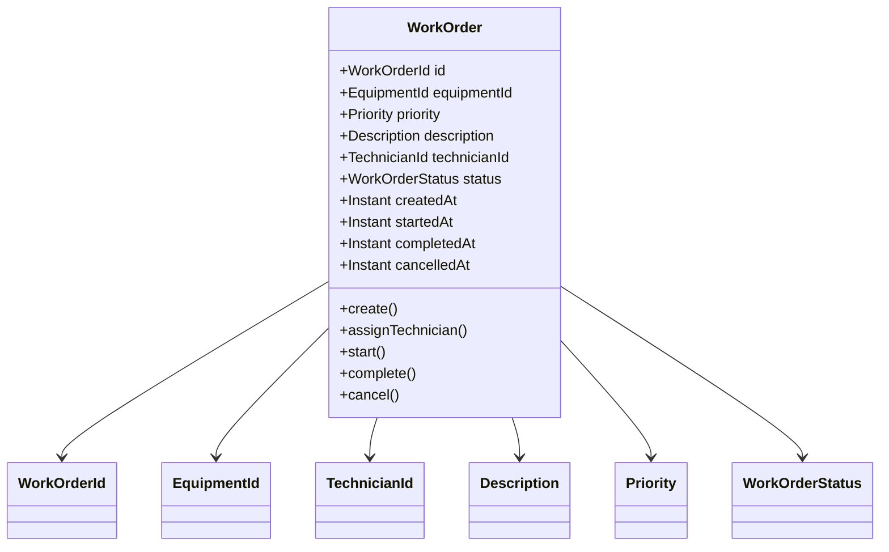
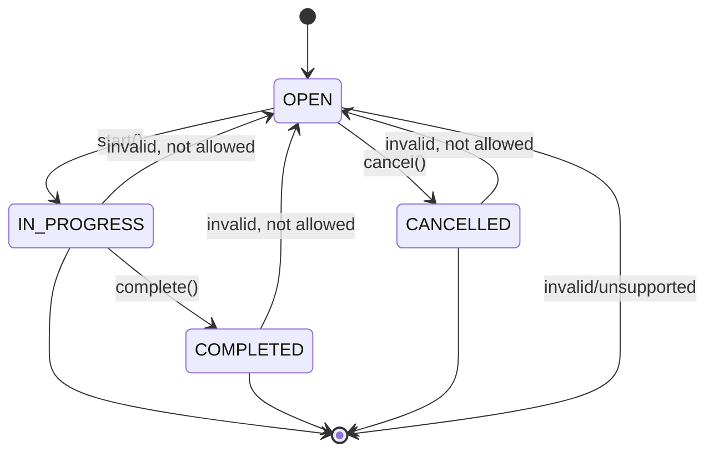

# Mô hình domain đề xuất cho Work Order Management

> Tài liệu này là bản mô tả thiết kế domain theo hướng DDD cho tính năng “Quản lý Phiếu công việc” (Work Order). Nó được xây dựng trên nền hiện tại của repo `web`, vốn đang là một Spring Boot/Maven scaffold demo và chưa triển khai domain Work Order. Vì vậy, đây là đề xuất kiến trúc miền, không phải mô tả code đã tồn tại trong source hiện tại.

## 1. Bối cảnh miền và Bounded Context Overview

### 1.1 Bối cảnh nghiệp vụ
Trong bối cảnh vận hành thiết bị và kỹ thuật, doanh nghiệp cần theo dõi các công việc bảo trì, sửa chữa, kiểm tra và xử lý sự cố theo từng thiết bị cụ thể. Mỗi công việc được biểu diễn bằng một Work Order, là đơn vị nghiệp vụ chính để:

- định danh và truy vết công việc theo thiết bị;
- gán trách nhiệm cho người thực hiện;
- theo dõi tiến độ và trạng thái xử lý;
- kết thúc công việc ở các trạng thái hợp lệ.

### 1.2 Bounded Context đề xuất
Bounded Context được đề xuất là:

- `Work Order Management`

Bounded context này chịu trách nhiệm về lifecycle của Work Order, bao gồm:

- tạo phiếu;
- xác định thiết bị liên quan;
- xác định mức độ ưu tiên;
- phân công kỹ thuật viên;
- chuyển trạng thái từ mở đến xử lý đến kết thúc;
- phát sinh các domain events phục vụ giám sát, audit và tích hợp với các hệ thống khác.

### 1.3 Liên hệ với các bounded context khác
Về mặt thiết kế, Work Order có thể tương tác với các context khác nhưng không phải là phần của domain này:

- `Equipment Management`: quản lý thiết bị, trạng thái thiết bị, lịch bảo dưỡng;
- `Technician Management`: hồ sơ thợ, năng lực, ca làm việc;
- `Notification / Scheduling`: gửi thông báo và lên lịch công việc;
- `Authorization / Access Control`: kiểm soát ai được tạo, sửa, hoàn thành, hủy work order.

> Lưu ý: vì repo hiện tại chưa có các module chuyên biệt cho các bounded context này, phần này được giữ ở mức giả định thiết kế và cần xác nhận với nghiệp vụ.

---

## 2. Mục tiêu, phạm vi và giả định của domain Work Order

### 2.1 Mục tiêu
Mục tiêu của bounded context là cung cấp một model rõ ràng cho việc quản lý phiếu công việc, với các ưu tiên:

- dễ truy vết công việc theo thiết bị;
- đảm bảo quy trình trạng thái rõ ràng và không cho phép chuyển ngược;
- giảm rủi ro sai lệch khi phân công kỹ thuật viên hoặc kết thúc công việc;
- hỗ trợ tích hợp sự kiện (event-driven) để cảnh báo, dashboard và audit trail.

### 2.2 Phạm vi trong scope
Các yếu tố nằm trong phạm vi đề xuất:

- `WorkOrder` là aggregate root;
- mỗi work order gắn với `EquipmentId` và có `Priority`;
- mô tả công việc bằng `Description`;
- có thể gán `TechnicianId` cho thợ thực hiện;
- lifecycle trạng thái theo chuỗi: `OPEN -> IN_PROGRESS -> COMPLETED` hoặc `OPEN -> CANCELLED`;
- phát sinh domain events cho quá trình tạo, bắt đầu, hoàn thành, hủy, gán kỹ thuật viên;
- dữ liệu cần validate trước khi thực thi hành vi domain.

### 2.3 Phạm vi ngoài scope
Các yếu tố sau có thể thuộc domain khác hoặc chưa cần xác nhận ngay:

- lập lịch công việc theo thời gian và ca làm việc;
- đánh giá kỹ thuật viên theo năng lực/kinh nghiệm;
- quản lý vật tư, linh kiện, tồn kho;
- tính chi phí, báo giá, hợp đồng bảo dưỡng;
- phê duyệt công việc trước khi bắt đầu;
- quy trình phản hồi hoặc đóng công việc bằng hình thức approval phức tạp.

### 2.4 Giả định thiết kế
Các giả định dưới đây là cần thiết để làm rõ model nhưng có thể cần xác nhận với nghiệp vụ:

1. `EquipmentId` là định danh ổn định của thiết bị và phải tồn tại trong hệ thống quản lý thiết bị.
2. `TechnicianId` là định danh của người thực hiện và có thể là null lúc khởi tạo work order.
3. `Description` có độ dài tối đa hợp lý, giả định là 500 ký tự, cần xác nhận lại với nghiệp vụ.
4. `Priority` có thể là enum gồm `LOW`, `MEDIUM`, `HIGH`, `CRITICAL`.
5. `OPEN` là trạng thái khởi tạo; `COMPLETED` và `CANCELLED` là trạng thái cuối.
6. Trạng thái công việc không được chuyển ngược sau khi đã vượt qua trạng thái hiện tại.
7. Để bắt đầu Công việc, có thể yêu cầu phải có technician được gán, tùy theo chính sách nghiệp vụ.

---

## 3. Aggregate Root `WorkOrder`

### 3.1 Trách nhiệm
`WorkOrder` là Aggregate Root và là trung tâm của bounded context. Nó bảo vệ tính toàn vẹn của toàn bộ trạng thái liên quan đến một công việc, đồng thời kiểm soát mọi thay đổi theo business rule.

Trách nhiệm chính:

- quản lý identity và metadata của phiếu công việc;
- giữ trạng thái hiện tại của công việc;
- bảo vệ ràng buộc nghiệp vụ liên quan đến thiết bị, ưu tiên, mô tả, kỹ thuật viên;
- xác định các chuyển trạng thái hợp lệ;
- phát sinh domain events khi sự kiện nghiệp vụ xảy ra.

### 3.2 Identity
Identity của aggregate root:

- `WorkOrderId` (value object hoặc ID dạng string/UUID)

Mỗi work order phải có ID duy nhất, không thay đổi trong suốt vòng đời.

### 3.3 Thuộc tính chính
`WorkOrder` có thể được mô tả như sau:

```text
WorkOrder
- id: WorkOrderId
- equipmentId: EquipmentId
- priority: Priority
- description: Description
- technicianId: TechnicianId | null
- status: WorkOrderStatus
- createdAt: Instant
- startedAt: Instant | null
- completedAt: Instant | null
- cancelledAt: Instant | null
- version: long (tuỳ chọn cho optimistic locking)
```

### 3.4 Các hành vi chính
Các hành vi domain nên nằm trong aggregate root thay vì ở service thuần túy, vì đây là nơi kiểm soát invariant và trạng thái của entity chính.

- `create(...)`: khởi tạo work order tại trạng thái `OPEN`
- `assignTechnician(TechnicianId technicianId)`: gán thợ cho công việc
- `start()`: chuyển từ `OPEN` sang `IN_PROGRESS`
- `complete()`: chuyển từ `IN_PROGRESS` sang `COMPLETED`
- `cancel()`: chuyển từ `OPEN` sang `CANCELLED`
- `changePriority(Priority newPriority)`: thay đổi mức ưu tiên nếu nghiệp vụ cho phép
- `updateDescription(Description newDescription)`: cập nhật mô tả nếu đang ở trạng thái cho phép

### 3.5 Các phương thức thay đổi trạng thái
Trong DDD, các method thay đổi trạng thái nên là các hành vi kinh doanh chứ không chỉ đặt thuộc tính. Ví dụ:

```java
public class WorkOrder {
    public void assignTechnician(TechnicianId technicianId) {
        if (status != WorkOrderStatus.OPEN) {
            throw new IllegalStateException("Only OPEN work orders can be assigned.");
        }
        this.technicianId = technicianId;
    }

    public void start() {
        if (status != WorkOrderStatus.OPEN) {
            throw new IllegalStateException("Only OPEN work orders can start.");
        }
        if (technicianId == null) {
            throw new IllegalStateException("Technician must be assigned before starting work order.");
        }
        this.status = WorkOrderStatus.IN_PROGRESS;
        this.startedAt = Instant.now();
    }

    public void complete() {
        if (status != WorkOrderStatus.IN_PROGRESS) {
            throw new IllegalStateException("Only IN_PROGRESS work orders can be completed.");
        }
        this.status = WorkOrderStatus.COMPLETED;
        this.completedAt = Instant.now();
    }

    public void cancel() {
        if (status != WorkOrderStatus.OPEN) {
            throw new IllegalStateException("Only OPEN work orders can be cancelled.");
        }
        this.status = WorkOrderStatus.CANCELLED;
        this.cancelledAt = Instant.now();
    }
}
```

> Cách triển khai cụ thể có thể là Java class trong package domain, nhưng nội dung trên chỉ là mô hình logic cho thiết kế domain, không bắt buộc phải khớp với code hiện tại.

---

## 4. Các Entity và Value Object liên quan

### 4.1 `WorkOrderId`
- Loại: Value Object / Identifier
- Mục đích: định danh duy nhất cho WorkOrder
- Đặc điểm: immutable, có thể là UUID string hoặc dạng typed value object
- Ràng buộc: không null, không rỗng

Ví dụ:

```text
WorkOrderId = "WO-2026-000123"
```

### 4.2 `EquipmentId`
- Loại: Value Object
- Mục đích: tham chiếu đến thiết bị liên quan
- Đặc điểm: immutable
- Ràng buộc: không null, không rỗng, định dạng có thể là UUID hoặc mã thiết bị nội bộ

### 4.3 `TechnicianId`
- Loại: Value Object
- Mục đích: tham chiếu đến người thực hiện
- Đặc điểm: immutable
- Ràng buộc: không null khi đã phân công, không được trùng với người khác trong cùng work order

### 4.4 `Description`
- Loại: Value Object
- Mục đích: mô tả công việc cần làm
- Ràng buộc:
  - không null / không rỗng;
  - trim khoảng trắng;
  - tối thiểu 1 ký tự, tối đa giả định là 500 ký tự;
  - tránh chỉ chứa khoảng trắng.

### 4.5 `Priority`
- Loại: enum hoặc value object
- Các giá trị đề xuất: `LOW`, `MEDIUM`, `HIGH`, `CRITICAL`
- Mục đích: biểu thị mức độ ưu tiên công việc
- Ràng buộc: phải thuộc tập giá trị hợp lệ

### 4.6 `WorkOrderStatus`
- Loại: enum
- Giá trị đề xuất:

```text
OPEN
IN_PROGRESS
COMPLETED
CANCELLED
```

- Mục đích: biểu diễn trạng thái lifecycle của work order
- Quy tắc: không cho chuyển ngược, trạng thái cuối là `COMPLETED` và `CANCELLED`

### 4.7 Các loại khác nếu cần
Cần thiết trong thiết kế mở rộng, nhưng không bắt buộc cho scope hiện tại:

- `WorkOrderCreatedAt` / `WorkOrderTimestamp`: value object chứa thời gian tạo, bắt đầu, kết thúc
- `Assignment`: có thể là value object nếu muốn lưu lịch sử gán thợ;
- `WorkOrderNote`: nếu cần ghi chú bổ sung trong quá trình xử lý;
- `WorkOrderHistory`: entity riêng nếu hệ thống cần audit lịch sử trạng thái hoặc timeline.

> Trong scope hiện tại, `WorkOrder` có thể giữ các trường timestamp đơn giản thay vì tách thành nhiều entity phụ.

---

## 5. Invariants và business rules

### 5.1 Trường bắt buộc
Một work order hợp lệ phải có:

- `WorkOrderId`
- `EquipmentId`
- `Priority`
- `Description`
- `status`
- `createdAt`

`TechnicianId` là bắt buộc hoặc không bắt buộc tùy chính sách, nhưng nếu đã gán thì không thể rỗng.

### 5.2 Giới hạn độ dài mô tả
Giả định thiết kế:

- `Description` tối thiểu 1 ký tự
- `Description` tối đa 500 ký tự
- nội dung sẽ được trim trước khi lưu và validate

> Nếu nghiệp vụ yêu cầu dài hơn, cần xác nhận lại. Đây là một giả định thiết kế, không phải yêu cầu đã được xác nhận.

### 5.3 Điều kiện phân công technician
Ràng buộc đề xuất:

- chỉ được phân công khi `status == OPEN`;
- `TechnicianId` không được null khi thực hiện phân công;
- một work order chỉ có tối đa một technician được giao thực hiện tại một thời điểm;
- không được thay đổi technician sau khi work order đã bắt đầu hoặc đã kết thúc.

### 5.4 Điều kiện bắt đầu work order
`start()` chỉ hợp lệ nếu:

- `status == OPEN`;
- `equipmentId` không null;
- `description` hợp lệ;
- `technicianId` đã được gán, nếu chính sách bắt buộc kỹ thuật viên trước khi bắt đầu.

Nếu không đủ điều kiện, ném exception hoặc trả về lỗi domain.

### 5.5 Điều kiện hoàn thành WorkOrder
`complete()` chỉ hợp lệ nếu:

- `status == IN_PROGRESS`;
- đã có technician được phân công (nếu chính sách yêu cầu);
- work order chưa ở trạng thái kết thúc.

### 5.6 Điều kiện hủy WorkOrder
`cancel()` chỉ hợp lệ nếu:

- `status == OPEN`;
- không ở trạng thái kết thúc;
- không thể hủy một work order đã được bắt đầu hoặc hoàn thành.

### 5.7 Chuyển trạng thái hợp lệ và không hợp lệ
#### Chuyển đổi hợp lệ
- `OPEN -> IN_PROGRESS`
- `OPEN -> CANCELLED`
- `IN_PROGRESS -> COMPLETED`

#### Chuyển đổi không hợp lệ
- `IN_PROGRESS -> OPEN` (không cho phép chuyển ngược)
- `COMPLETED -> *` (trạng thái kết thúc)
- `CANCELLED -> *` (trạng thái kết thúc)
- `OPEN -> COMPLETED` (trừ phi nghiệp vụ có quy trình đặc biệt; theo đề xuất hiện tại không cho phép)
- `OPEN -> OPEN` với no-op hoặc không có tác động thực tế

### 5.8 Quyền hoặc actor được phép thực hiện hành động
Vì repo đang thiếu thông tin xác thực/authorization, cần quy định dưới dạng giả định thiết kế:

- `Creator/Dispatcher` có thể tạo work order và gán ưu tiên, mô tả, thiết bị.
- `Supervisor/Planner` hoặc người có quyền vận hành có thể phân công technician.
- `Technician` có thể bắt đầu và hoàn thành công việc khi được giao.
- `Supervisor` hoặc người có quyền phù hợp có thể hủy work order ở trạng thái `OPEN`.

> Lưu ý: đây là giả định thiết kế; cần xác nhận quyền thực thi với nghiệp vụ và hệ thống IAM/authorization thực tế.

---

## 6. Domain events có thể phát sinh
Domain events là các sự kiện nghiệp vụ có giá trị cho audit, thông báo, dashboard, và tích hợp giữa các bounded context.

### 6.1 `WorkOrderCreated`
- Mục đích: khi work order được tạo
- Thông tin: `workOrderId`, `equipmentId`, `priority`, `description`, `createdAt`

### 6.2 `TechnicianAssigned`
- Mục đích: khi gán thợ thực hiện
- Thông tin: `workOrderId`, `technicianId`, `assignedAt`

### 6.3 `WorkOrderStarted`
- Mục đích: khi bắt đầu xử lý công việc
- Thông tin: `workOrderId`, `technicianId`, `startedAt`

### 6.4 `WorkOrderCompleted`
- Mục đích: khi hoàn thành công việc
- Thông tin: `workOrderId`, `technicianId`, `completedAt`

### 6.5 `WorkOrderCancelled`
- Mục đích: khi hủy công việc
- Thông tin: `workOrderId`, `cancelledAt`, `reason` (nếu có)

### 6.6 Lưu ý về event sourcing vs log sự kiện
Với scope hiện tại, domain events có thể được sử dụng như:

- event nội bộ trong ứng dụng;
- event publish để gửi qua message bus hoặc webhook;
- audit log để tiện truy vết.

Không bắt buộc phải triển khai event sourcing ngay từ đầu; chỉ cần phát sinh và xử lý như một pattern domain chuẩn.

---

## 7. Sơ đồ domain và sơ đồ chuyển đổi trạng thái bằng Mermaid

### 7.1 Sơ đồ domain aggregate



### 7.2 Sơ đồ trạng thái



---

## 8. Bảng chuyển trạng thái hợp lệ/không hợp lệ

| Trạng thái hiện tại | Trạng thái mục tiêu | Hợp lệ | Ghi chú |
| :--- | :--- | :--- | :--- |
| OPEN | OPEN | Không | No-op, không đổi trạng thái |
| OPEN | IN_PROGRESS | Có | Chỉ khi điều kiện bắt đầu được thỏa mãn |
| OPEN | COMPLETED | Không | Không cho phép bỏ qua tiến độ |
| OPEN | CANCELLED | Có | Hủy work order ở trạng thái mở |
| IN_PROGRESS | OPEN | Không | Không cho phép chuyển ngược |
| IN_PROGRESS | IN_PROGRESS | Không | No-op, không đổi trạng thái |
| IN_PROGRESS | COMPLETED | Có | Kết thúc công việc |
| IN_PROGRESS | CANCELLED | Không | Theo quy tắc đề xuất, hủy chỉ ở OPEN |
| COMPLETED | * | Không | `COMPLETED` là trạng thái kết thúc |
| CANCELLED | * | Không | `CANCELLED` là trạng thái kết thúc |

### Bảng trạng thái theo business rule ngắn gọn

| Từ | Sang | Quy tắc |
| :--- | :--- | :--- |
| OPEN | IN_PROGRESS | Hợp lệ nếu chấp nhận điều kiện bắt đầu |
| OPEN | CANCELLED | Hợp lệ nếu work order chưa bắt đầu |
| IN_PROGRESS | COMPLETED | Hợp lệ nếu công việc đã được thực hiện xong |
| * | OPEN | Không hợp lệ |
| * | nguy cơ lùi trạng thái | Không hợp lệ |
| COMPLETED | * | Không hợp lệ |
| CANCELLED | * | Không hợp lệ |

---

## 9. Gợi ý mapping vào cấu trúc Maven hiện tại

### 9.1 Về cấu trúc hiện tại của repo
Repo hiện tại đang ở dạng:

- một Maven project Spring Boot đơn lẻ;
- package chính hiện là `com.posco.mci.myBigNumber`;
- controller/service demo đang triển khai tính năng cộng số và import CSV;
- chưa có module domain riêng cho Work Order.

Do đó, hiện tại repo chưa đủ cấu trúc multi-module để tách DDD theo chuẩn chuyên nghiệp, nhưng vẫn có thể đề xuất cách tổ chức tương lai.

### 9.2 Đề xuất module hóa DDD phù hợp
Nếu chuyển sang mô hình domain rõ ràng, gợi ý phân chia như sau:

- `domain-api` module
  - chứa các interfaces/ports, `WorkOrder`, `WorkOrderId`, `EquipmentId`, `TechnicianId`, `Priority`, `WorkOrderStatus`, domain events
  - mục tiêu: giữ model domain thuần túy, không phụ thuộc framework

- `application` module
  - chứa `WorkOrderService`, use cases, validation business logic, orchestration
  - chịu trách nhiệm kiểm soát flow nghiệp vụ nhưng không chứa code JPA/HTTP trực tiếp

- `persistence-jpa` module
  - chứa repository implementation, JPA entity mapping, converter cho `WorkOrderStatus`, `Description`, `Priority`
  - trách nhiệm: lưu trữ và load aggregate

- `controller` / `adapter-web` module
  - chứa REST controller, request/response DTO, mapping giữa HTTP model và domain model
  - không chứa business rules chính thức, chỉ chuyển đổi giao tiếp

### 9.3 Nếu giữ nguyên cấu trúc hiện tại
Nếu không chia module ngay, nên đặt các package theo tầng sau:

```text
com.posco.mci.workorder
  domain/
    WorkOrder.java
    WorkOrderId.java
    EquipmentId.java
    TechnicianId.java
    Description.java
    Priority.java
    WorkOrderStatus.java
  application/
    WorkOrderService.java
  infrastructure/
    persistence/
      JpaWorkOrderRepository.java
  api/
    WorkOrderController.java
```

> Lưu ý: đây là cấu trúc đề xuất, phù hợp với mô hình DDD chứ không phản ánh source đang có trong repo.

---

## 10. Phân biệt rõ yêu cầu đã xác định, giả định thiết kế và câu hỏi cần xác nhận

### 10.1 Yêu cầu đã được xác định
Các yêu cầu dưới đây là rõ ràng từ bối cảnh đề xuất và không cần suy đoán:

- WorkOrder gắn với `EquipmentId`.
- WorkOrder có `Priority`.
- WorkOrder có `Description`.
- WorkOrder có thể gán `TechnicianId`.
- Vòng đời trạng thái: `OPEN -> IN_PROGRESS -> COMPLETED` hoặc `OPEN -> CANCELLED`.
- Không cho phép chuyển ngược trạng thái.
- `COMPLETED` và `CANCELLED` là trạng thái kết thúc.

### 10.2 Giả định thiết kế
Các điểm dưới đây là giả định để hoàn thiện model, nhưng chưa có xác nhận từ nghiệp vụ:

- `Description` max length 500 ký tự.
- `Priority` gồm `LOW | MEDIUM | HIGH | CRITICAL`.
- `TechnicianId` phải được gán trước khi bắt đầu work order.
- Hủy chỉ cho phép từ `OPEN`.
- `TechnicianId` là optional khi tạo nhưng bắt buộc trước khi bắt đầu hoặc hoàn thành.
- Actor có quyền: supervisor/creator/technician cần xác nhận rõ hơn.

### 10.3 Thông tin cần xác nhận với nghiệp vụ
Những câu hỏi mở cần được trả lời để finalize domain model:

1. WorkOrder có cần phân loại theo loại công việc không, ví dụ bảo trì, sửa chữa, kiểm tra, khắc phục sự cố?
2. `TechnicianId` có bắt buộc ngay khi tạo hay chỉ bắt buộc trước khi bắt đầu công việc?
3. `Description` có giới hạn độ dài cố định không, và cần định dạng nào (textarea, rich text, markdown)?
4. `Priority` cần dùng enum cố định hay cho phép tùy chỉnh theo cấu hình?
5. Có cần “hủy vì lý do” hay “hủy vì không thể thực hiện” không? Nếu có, cần thêm field `CancellationReason`.
6. Có cần lưu lịch sử trạng thái đầy đủ (timeline) không?
7. Có cần lưu `assignedAt`, `startedAt`, `completedAt` theo timestamp không?
8. Quyền đọc/ghi cho từng actor (`creator`, `technician`, `supervisor`, `admin`) là gì?
9. Có cần tính năng reopen hoặc reschedule không? Nếu có, state machine sẽ khác.
10. Có cần tích hợp với module thiết bị và kỹ thuật viên như một dependency hoặc chỉ là tham chiếu ID?

---

## Kết luận

Mô hình domain đề xuất cho Work Order Management nên tập trung vào `WorkOrder` như Aggregate Root, với lifecycle rõ ràng và các invariant chặt chẽ. Trong bối cảnh repo hiện tại, đây là tài liệu thiết kế hướng tới chuẩn DDD, chứ không phải code hiện có. Điều quan trọng là giữ cho business rule nằm trong domain, tránh để validation và state transitions bị tản mát sang controller hoặc service thuần túy.

Từ góc nhìn thiết kế, việc đầu tiên cần xác nhận với nghiệp vụ là:

- chính sách bắt buộc `TechnicianId`;
- độ dài và định dạng `Description`;
- quyền thực thi của từng actor;
- liệu có cần mở rộng lifecycle với `REOPENED`, `ON_HOLD`, `RESCHEDULED` hay không.

Sau khi các câu hỏi này được làm rõ, mô hình domain này có thể được chuyển thành các lớp Java, repository, use case và REST API theo cấu trúc Maven/Spring Boot của dự án.
